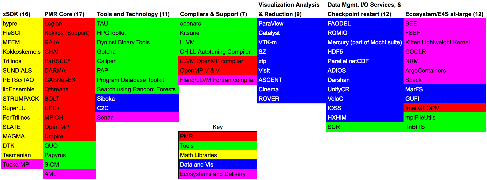

This is a collection of configurations for building ECP SDK
containers with combinations of packages, including the full
E4S set.

These are the set of stacks that are targeted for the first release:

The configuration files for each container platform will be specified under each directory.  For example, the Docker configurations are under the "docker" subdirectory.  Each subdirectory will have a README.md file to explain how to build the container image for each stack.